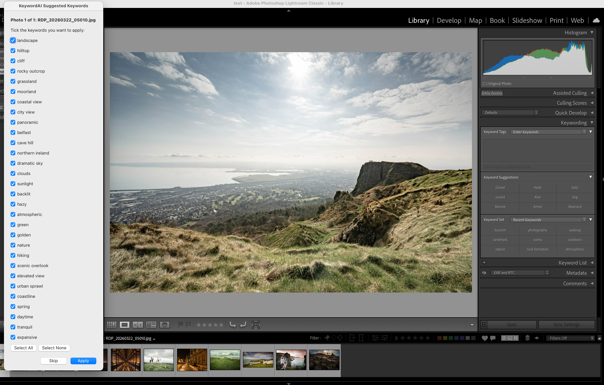
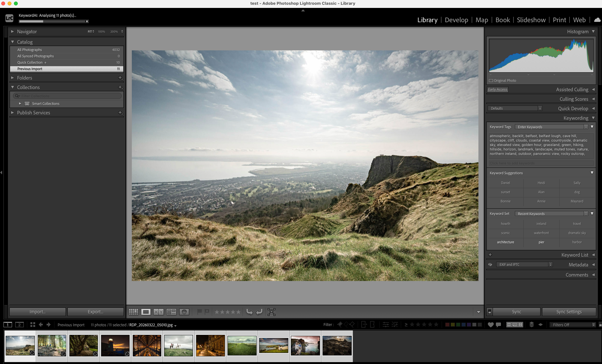
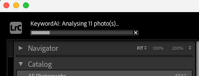
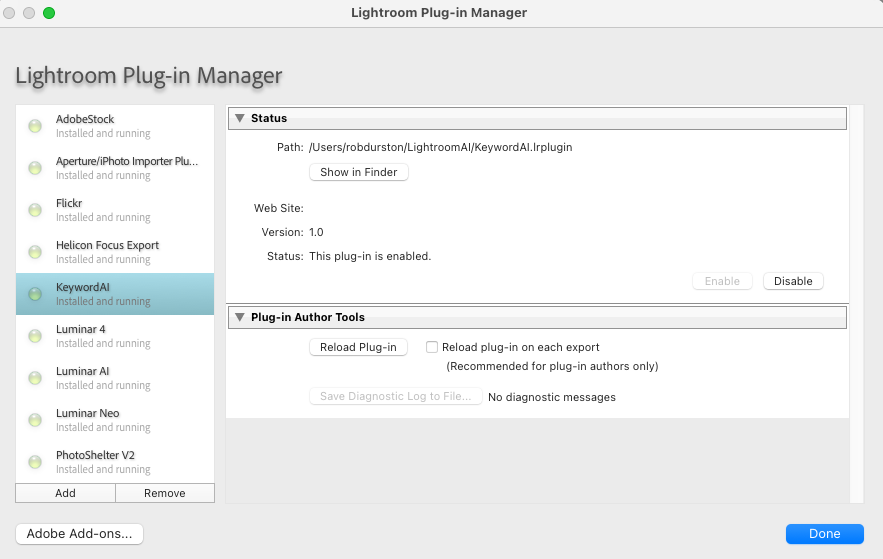

# KeywordAI — AI-Powered Keyword Suggestions for Adobe Lightroom Classic

**KeywordAI** is a free, open-source Adobe Lightroom Classic plugin that uses Claude AI (by Anthropic) to automatically analyse your photos and suggest relevant keywords — saving you hours of manual keywording.

Built by **[Rob Durston](https://www.belfastphotoworkshops.com)** & Claude (Anthropic) — [Belfast Photo Workshops](https://www.belfastphotoworkshops.com)

---

## Screenshots


*The Review & Select mode — tick the keywords you want, untick the ones you don't*


*Keywords applied directly to your photo's metadata in Lightroom*


*Auto mode — batch process multiple photos with a progress bar and no interruptions*


*KeywordAI installed and running in the Lightroom Plug-in Manager*

---

## What It Does

Select one or more photos in Lightroom, run the plugin, and within seconds Claude AI will analyse each image and suggest up to 30 relevant keywords covering:

- 📷 Subjects (people, animals, objects)
- 🌍 Location & setting (beach, forest, urban, countryside)
- 💡 Lighting & time of day (golden hour, overcast, low light)
- 🎭 Mood & atmosphere (dramatic, peaceful, moody)
- 🎨 Colours (if distinctive)
- 🏃 Activities & actions
- 📸 Photographic style (portrait, landscape, macro, street)

### Two Modes

**Review & Select** — Shows you all suggested keywords with checkboxes. Tick the ones you want, untick the ones you don't, then click Apply. Includes "Select All" and "Select None" buttons.

**Auto (No Prompts)** — Automatically analyses all selected photos and writes keywords directly to each one with no interruptions. Shows a progress bar and a summary when done. Perfect for batch processing.

---

## Requirements

Before installing the plugin you will need the following:

- **Adobe Lightroom Classic** (version 5 or later)
- **Python 3** — Download free from [python.org](https://python.org)
- **An Anthropic API key** — Sign up at [console.anthropic.com](https://console.anthropic.com)
- **Anthropic API credits** — Add a minimum of $5 at [console.anthropic.com](https://console.anthropic.com). Each photo analysis costs a fraction of a penny so $5 will last a very long time.

### Supported Image Formats
- JPEG (.jpg, .jpeg)
- PNG (.png)
- HEIC (.heic) — iPhone photos
- WebP (.webp)
- RAW files are supported as long as Lightroom has generated a preview

---

## Installation

### Step 1 — Install Python 3
Download and install Python 3 from [python.org/downloads](https://python.org/downloads).

**Mac users:** Just click Install — Python is added to your path automatically.

**Windows users:** On the first screen of the installer, make sure to tick **"Add Python to PATH"** before clicking Install.

To verify Python installed correctly, open Terminal (Mac) or Command Prompt (Windows) and type:
```
python3 --version
```
You should see a version number like `Python 3.13.x`.

### Step 2 — Install Required Python Libraries
In Terminal or Command Prompt, run:
```
pip3 install anthropic Pillow pillow-heif
```

### Step 3 — Get an Anthropic API Key
1. Go to [console.anthropic.com](https://console.anthropic.com) and create a free account
2. Click **API Keys** in the left sidebar
3. Click **Create Key**, give it a name like "Lightroom Plugin"
4. Copy the key — it starts with `sk-ant-...`
5. **Important:** Save it somewhere safe. You won't be able to see it again after closing the page.
6. Go to **Plans & Billing** and add at least $5 in credits

### Step 4 — Download the Plugin
Click the green **Code** button at the top of this page and choose **Download ZIP**. Unzip the file and you will find:
- `KeywordAI.lrplugin` — the Lightroom plugin folder
- `suggest_keywords.py` — the Python helper script

### Step 5 — Set Up the Files
Create a folder called `LightroomAI` in your home folder:

**Mac:**
```
mkdir ~/LightroomAI
```
**Windows:**
```
mkdir %USERPROFILE%\LightroomAI
```

Copy both `KeywordAI.lrplugin` and `suggest_keywords.py` into that `LightroomAI` folder.

### Step 6 — Add Your API Key
Open `suggest_keywords.py` in a text editor and find this line near the top:
```
API_KEY = "YOUR-API-KEY-HERE"
```
Replace `YOUR-API-KEY-HERE` with your actual Anthropic API key. Save the file.

### Step 7 — Install the Plugin in Lightroom
1. Open **Lightroom Classic**
2. Go to **File → Plug-in Manager**
3. Click **Add**
4. Navigate to your `LightroomAI` folder and select `KeywordAI.lrplugin`
5. Click **Add Plug-in**
6. The plugin should appear in the list with a green dot and say "Installed and running"
7. Click **Done**

---

## Usage

1. Select one or more photos in Lightroom's Library module
2. Go to **Library → Plug-in Extras** in the menu bar
3. Choose one of:
   - **Suggest Keywords (Review and Select)** — review keywords before applying
   - **Suggest Keywords (Auto, No Prompts)** — apply all keywords automatically

---

## How Much Does It Cost To Run?

The plugin uses the Anthropic Claude API which charges per use. As a rough guide:
- Analysing a single photo costs approximately **$0.01 or less**
- $5 of credits will comfortably cover **hundreds of photos**
- You only pay for what you use — there is no subscription

---

## Troubleshooting

**"No keywords returned"**
- Check your API key is correctly pasted into `suggest_keywords.py`
- Make sure you have credits in your Anthropic account at [console.anthropic.com](https://console.anthropic.com)
- Test the Python script directly in Terminal: `python3 ~/LightroomAI/suggest_keywords.py /path/to/photo.jpg`

**"Could not find namespace" error in Lightroom**
- Make sure both files (`KeywordAI.lrplugin` and `suggest_keywords.py`) are in the same `LightroomAI` folder
- Try reloading the plugin via File → Plug-in Manager → Reload Plug-in

**HEIC files not working**
- Make sure you installed `pillow-heif`: `pip3 install pillow-heif`

**Plugin not appearing in Library menu**
- Make sure you are in the **Library** module in Lightroom (not Develop)
- Check the plugin shows a green dot in Plug-in Manager

---

## Privacy

Your photos are sent to Anthropic's Claude API for analysis. Anthropic's privacy policy applies. No photos or keywords are stored or shared by this plugin beyond what is required to call the API. We recommend reviewing [Anthropic's privacy policy](https://www.anthropic.com/privacy) before use.

---

## Contributing

Contributions are welcome! If you have ideas for improvements, find a bug, or want to add a feature, please open an issue or submit a pull request.

Some ideas for future development:
- Windows installer / setup wizard
- Customisable keyword categories and prompts
- Support for writing keywords to XMP sidecar files
- Batch processing with rate limiting
- Keyword filtering and blocklists

---

## Licence

This project is released under the **MIT Licence** — free to use, modify, and distribute.

---

## Acknowledgements

- Built with the [Anthropic Claude API](https://www.anthropic.com)
- Uses the [Adobe Lightroom Classic SDK](https://developer.adobe.com/lightroom/)
- Image processing via [Pillow](https://python-pillow.org) and [pillow-heif](https://github.com/bigcat88/pillow_heif)

---

*Made with ☕ and AI by [Rob Durston](https://www.belfastphotoworkshops.com) & Claude — [Belfast Photo Workshops](https://www.belfastphotoworkshops.com)*
